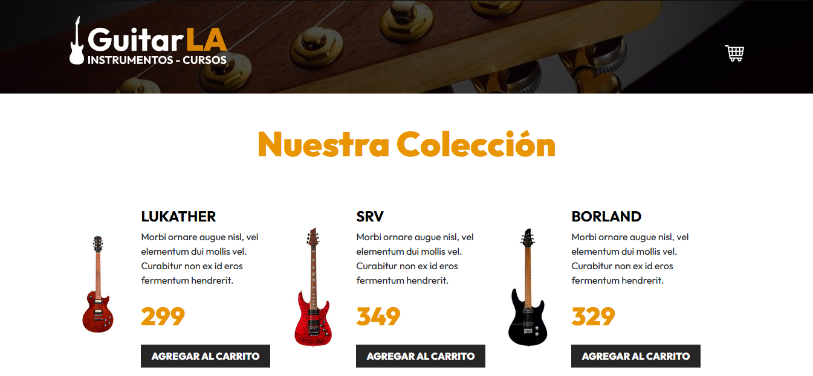

# React + Vite

GuitarShop - Lista de Guitarras con Carrito de Compras

GuitarShop es una aplicación web construida en React que muestra una lista de guitarras disponibles para la venta. Los usuarios pueden agregar guitarras a un carrito de compras interactivo, que cuenta con las siguientes funcionalidades:

   - Incrementar y decrementar la cantidad de un producto en el carrito.
   -  Eliminar productos del carrito.
   - Calcular automáticamente el precio total de los productos agregados.
   - Persistencia de datos en localStorage, asegurando que el carrito se mantenga incluso después de recargar la página.

Para la gestión del estado y la reactividad de la aplicación, se han utilizado los hooks de React useState y useEffect, garantizando una experiencia fluida y dinámica para el usuario.

Este proyecto es ideal para aprender y practicar conceptos clave de React, como el manejo del estado, el uso de efectos secundarios y la implementación de almacenamiento local.

